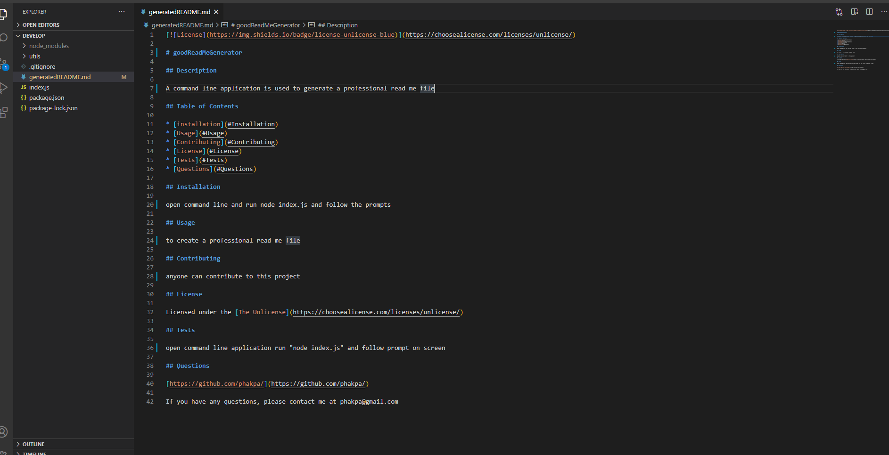
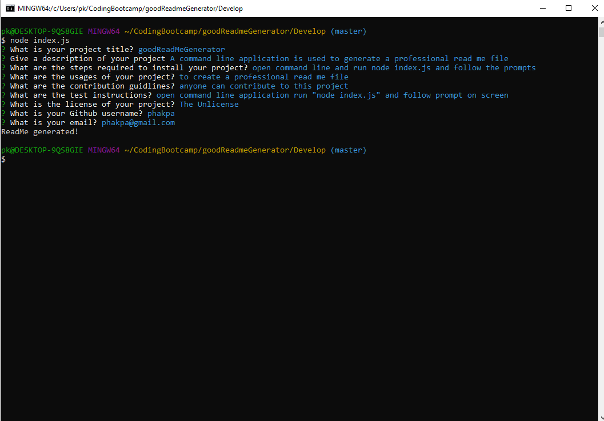

# Unit 09 Node.js and ES6+ Homework: Good README Generator

Command-line application is used to dynamically generate a professional README.md from a user's input about their project.

Here is the link to the Github repository. https://github.com/phakpa/goodReadmeGenerator

images below ------------------------------------------------------------------------------

